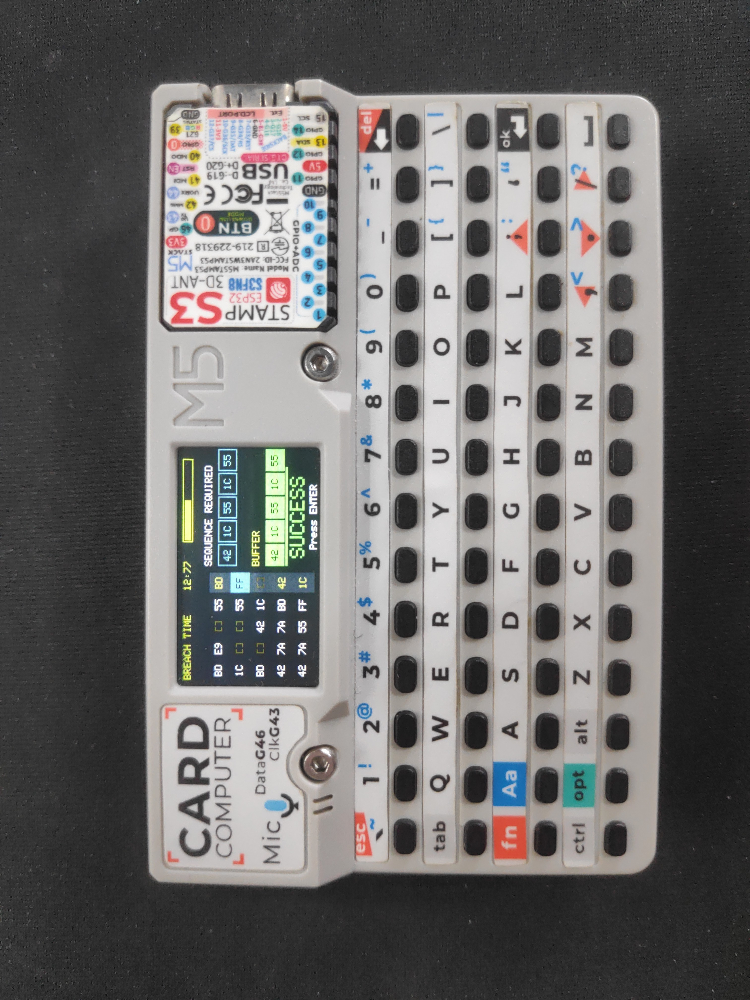

# M5Cardputer Cyberpunk 2077 Breach Protocol



A perfectly faithful, standalone port of the iconic Cyberpunk 2077 Breach Protocol minigame for the **M5Stack Cardputer** and **M5Stack CardputerADV**, written in pure C++.

## Features
- **100% Authentic Mechanics:** True "active line" constraints. You can only move left/right on rows and up/down on columns. Selecting a node flips the axis.
- **Dynamic Difficulty:** Grid sizes randomly scale between 3x3, 4x4, and 5x5 based on your success. Target sequences dynamically range from 4 to 6 hex codes.
- **Responsive Timer:** The timer dynamically scales with difficulty (15 to 25 seconds).
- **100% Solvability:** The sequence is generated by physically simulating a valid, non-overlapping path through the matrix. It is always mathematically possible to win.
- **Custom Cyberpunk Aesthetics:** Colors precisely match the in-game UI. Includes smooth cascading animations, blinking cursors, and text fades.
- **Flicker-Free Rendering:** 60FPS differential rendering means the progress bar and timer update perfectly smoothly with zero screen tearing.

## Installation

### Pre-built binary
1. Download `cardputer_breach.ino.merged.bin` from this repository.
2. Flash to address `0x0` on your ESP32-S3 (M5Cardputer or CardputerADV):
   ```bash
   esptool.py --chip esp32s3 --port /dev/ttyACM0 write_flash 0x0 cardputer_breach.ino.merged.bin
   ```

### Build from source (PlatformIO)
```bash
# Clone the repo
git clone https://github.com/hellasleeper108/m5cardputer-cyberpunk-breach-protocol.git
cd m5cardputer-cyberpunk-breach-protocol

# Build for CardputerADV (auto-detected at runtime)
pio run -e m5cardputer-adv

# Flash
pio run -e m5cardputer-adv -t upload
```

The M5Cardputer library auto-detects the board at runtime — the same binary works on both original Cardputer and CardputerADV. The PlatformIO project targets the ADV with PSRAM support enabled.

## Controls
- **W, A, S, D** or **Arrow Keys (via Fn + /, ;, ., ,)**: Move the cursor along the active line.
- **ENTER**: Select the highlighted node, or restart the game upon game over.
